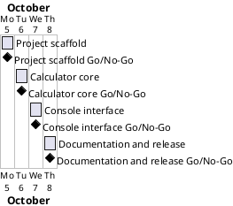

# Project Plan

## Metadata
| Key | Value |
| --- | --- |
| ID | PP-001 |
| CrossReference | [MIL-001], [MIL-002], [MIL-003], [MIL-004], [SA-001], [BC-001] |

## Version History
| Date | Status | Author | Reviewer | Change | Commit |
| --- | --- | --- | --- | --- | --- |
| 2026-10-04 | Accepted | Jens Tirsvad Nielsen | S01 | Initial version | [8ccefff] |

---

## Purpose

Schedule the four phases that deliver the console calculator of Udemy's "100 Days of Code" day 10 assignment. This is a very small project, so the Business Case is short and the Stakeholder Analysis names only the Product Owner (S01); the plan, the milestones and their tasks are the whole planning trail. Each phase is one branch and one pull request, and each task is synced as an issue.

## Planning Assumptions

- Work starts 2026-10-05 and ends by 2026-10-08, one phase per day.
- Owner and reviewer are the Product Owner, S01. The review is the Product Owner accepting the document.
- Product Owner language: English.
- Python 3.13 or newer, `venv`, `src/ tests/ docs/` layout, constants in `constants.py`, Doxygen comments.
- `.env` holds a personal token used only for tooling; the project never reads or tests it.
- Nothing is committed or pushed until the Product Owner asks.

## Gateway Schedule

| Gateway | Document | Window | Decision date | Owner | Stories | Main deliverable | Milestone |
| --- | --- | --- | --- | --- | --- | --- | --- |
| Project scaffold | [MIL-001] | 2026-10-05 | 2026-10-05 | S01 | | `pyproject.toml` | |
| Calculator core | [MIL-002] | 2026-10-06 | 2026-10-06 | S01 | | `src/calc/constants.py` and `src/calc/operations.py` | |
| Console interface | [MIL-003] | 2026-10-07 | 2026-10-07 | S01 | | `src/calc/calculator.py` and `src/calc/__main__.py` | |
| Documentation and release | [MIL-004] | 2026-10-08 | 2026-10-08 | S01 | | `README.md` following the project template | |



## Scope Coverage

| Scope item | Gateway |
| --- | --- |
| Project configuration, layout, `.gitignore`, Doxyfile, repository metadata | [MIL-001] |
| Operations stored in a dictionary of functions, constants, tests | [MIL-002] |
| Console interaction, ASCII art, continue with result, recursion | [MIL-003] |
| README, Doxygen build, setup verification, AGPL licence | [MIL-004] |

## Dependencies

```
MIL-001 -> MIL-002 -> MIL-003 -> MIL-004
```

A No-Go moves every later date by the time needed to fix the failed criterion.

## Plan Risks

| Risk | Impact | Mitigation |
| --- | --- | --- |
| Doxygen not installed on the machine | Docs check skipped | README names it as optional |
| Recursion depth on very long sessions | Crash after many restarts | Documented limit; sessions are short |

## Open Issues

- Milestone links in the Gateway Schedule are filled in after `sync-project.sh --apply`.

---

[MIL-001]: ./milestones/mil-001-project-scaffold.md
[MIL-002]: ./milestones/mil-002-calculator-core.md
[MIL-003]: ./milestones/mil-003-console-interface.md
[MIL-004]: ./milestones/mil-004-documentation-and-release.md
[SA-001]: ./stakeholder-analysis.md
[BC-001]: ./business-case.md
[8ccefff]: https://git.tirsystem.com/Tirsvad-Udemy-100_days_of_code/010-calc/commit/8ccefffef7ec1f9ecbf548085a5c92fae75e1341
